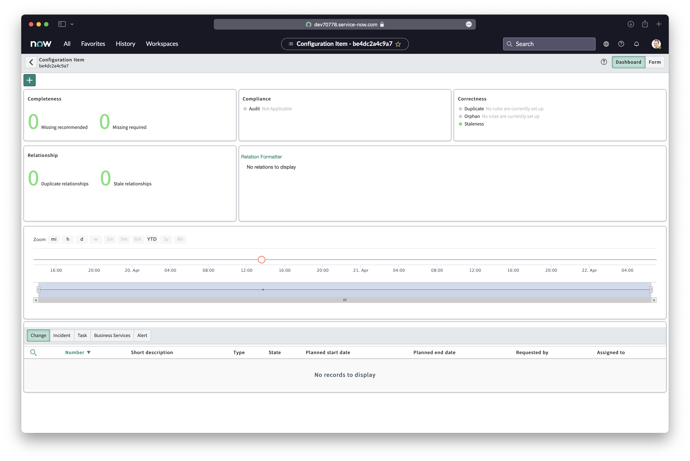

## Overview

<!-- Sensu Integration description; supports markdown -->

The ServiceNow CMDB Registration integration provides automated registration of discovered Sensu Entities as ServiceNow CMDB Configuration Items.

This integration will create/update ServiceNow CMDB Configuration Items.
It supports custom CMDB tables and custom CMDB fields, with per-host configuration overrides.
See the Setup section below for more information.

This integration is compatible with ServiceNow versions "Rome" or older.

<!-- Provide a high level overview of the integration contents (e.g. checks, filters, mutators, handlers, assets, etc) -->

This integration includes the following resources:

* `servicenow-cmdb` [pipeline]
* `servicenow-cmdb` [handler]
* `discovery-only` [filter]
* `sensu/sensu-servicenow-handler:3.0.0` [asset]

## Dashboards

<!-- List of compatible dashboards w/ screenshots (supports png, jpeg, and gif images; relative paths only; e.g. `` )-->

This integration is compatible with ServiceNow CMDB dashboards.



## Setup

<!-- Sensu Integration setup instructions, including Sensu agent configuration and external component configuration -->
<!-- EXAMPLE: what configuration (if any) is required in a third-party service to enable monitoring? -->

1. **Enable ServiceNow CMDB registration using `--keepalive-handlers`**

   To enable ServiceNow CMDB registration for all entities, configure the `--keepalive-handlers=servicenow-cmdb` flag, or modify `backend.yml` with the following contents, then restart the Sensu backend(s):

   ```yaml
   keepalive-handlers:
     - servicenow-cmdb
   ```

   _NOTE: in clustered deployments, you will need to configure & restart every Sensu backend for [`keepalive-handlers` configuration][keepalive-handlers] to take effect._

   Alternatively, checks configured with the `servicenow-cmdb` [pipeline] may be used to enable CMDB registration.

   Example:

   ```yaml
   spec:
     pipelines:
       - api_version: core/v2
         type: Pipeline
         name: servicenow-cmdb
   ```

   [keepalive-handlers]: https://docs.sensu.io/sensu-go/latest/observability-pipeline/observe-process/handlers/#keepalive-event-handlers

1. **[OPTIONAL] Customize ServiceNow CMDB configuration on a per-host basis**

   Sensu Entity annotations may be used to override the default ServiceNow CMDB integration configuration.

   Examples:

   ```yaml
   annotations:
     servicenow/config/cmdb-table: "cmdb_ci"
     servicenow/config/cmdb-asset-tag: "aws/us-west-2/instances/i-424242"
   ```

   For more information, please visit the [ServiceNow Handler "Annotations" reference documentation].

2. **[OPTIONAL] Customize ServiceNow CMDB Configuration Item properties**

   This integration supports custom ServiceNow CMDBs tables with custom fields.
   To enable custom fields set the `--cmdb-properties` flag (e.g. `--cmdb-properties asset_tag,store_id`).
   _NOTE: The integration installation wizard will prompt you for a list of custom fields._

   Once enabled, custom properties can be set on a per-host basis using `servicenow/table/cmdb/<fieldname>` Entity annotations.

   Example `agent.yml` (assuming `--cmdb-properties: asset_tag,store_id`):

   ```yaml
   annotations:
     servicenow/table/cmdb/asset_tag: "i-424242"
     servicenow/table/cmdb/store_id: "1234"
   ```

[Sensu Entity]: https://docs.sensu.io/sensu-go/latest/observability-pipeline/observe-entities/entities/
[ServiceNow Handler "Annotations" reference documentation]: https://bonsai.sensu.io/assets/sensu/sensu-servicenow-handler#annotations

## Plugins

<!-- Links to any Sensu Integration dependencies (i.e. Sensu Plugins) -->

- [sensu/sensu-servicenow-handler][sensu-servicenow-handler-bonsai]

## Metrics & Events

<!-- List of all metrics or events collected by this integration. -->

This integration does not produce any [metrics].

## Alerts

<!-- List of all alerts generated by this integration. -->

<!-- This integration provides an alert & incident management processing pipeline for use with other monitoring integrations. By default this integration will process all events passing the [built-in `is_incident` filter][is_incident] (i.e. failing events and resolution events only). Event processing via this integration may be suppressed using [Sensu Silencing][silences] (see the [built-in `not_silenced` filter][not_silenced] for more details). -->

This integration does not produce any events that should be processed by an alert or incident management [pipeline].

## Reference Documentation

<!-- Please provide links to any relevant reference documentation to help users learn more and/or troubleshoot this integration; specifically including any third-party software documentation. -->

1. This integration uses [Handler Templating][handler-templating] for variable substitution.

<!-- Links -->
[check]: https://docs.sensu.io/sensu-go/latest/observability-pipeline/observe-schedule/checks/
[asset]: https://docs.sensu.io/sensu-go/latest/plugins/assets/
[subscription]: https://docs.sensu.io/sensu-go/latest/observability-pipeline/observe-schedule/subscriptions/
[subscriptions]: https://docs.sensu.io/sensu-go/latest/observability-pipeline/observe-schedule/subscriptions/
[agents]: https://docs.sensu.io/sensu-go/latest/observability-pipeline/observe-schedule/agent/
[annotation]: https://docs.sensu.io/sensu-go/latest/observability-pipeline/observe-schedule/agent/#general-configuration-flags
[plugins]: https://docs.sensu.io/sensu-go/latest/plugins/
[metrics]: https://docs.sensu.io/sensu-go/latest/observability-pipeline/observe-schedule/metrics/
[pipeline]: https://docs.sensu.io/sensu-go/latest/observability-pipeline/observe-process/pipelines/
[handler]: https://docs.sensu.io/sensu-go/latest/observability-pipeline/observe-process/handlers/
[filter]: https://docs.sensu.io/sensu-go/latest/observability-pipeline/observe-filter/filters/
[filters]: https://docs.sensu.io/sensu-go/latest/observability-pipeline/observe-filter/filters/
[secret]: https://docs.sensu.io/sensu-go/latest/operations/manage-secrets/secrets/
[secrets]: https://docs.sensu.io/sensu-go/latest/operations/manage-secrets/secrets/
[tokens]: https://docs.sensu.io/sensu-go/latest/observability-pipeline/observe-schedule/tokens/
[handler-templating]: https://docs.sensu.io/sensu-go/latest/observability-pipeline/observe-process/handler-templates/
[sensu-plus]: https://sensu.io/features/analytics
[{{dashboard-link}}]: #
[sensu-servicenow-handler-bonsai]: https://bonsai.sensu.io/assets/sensu/sensu-servicenow-handler

