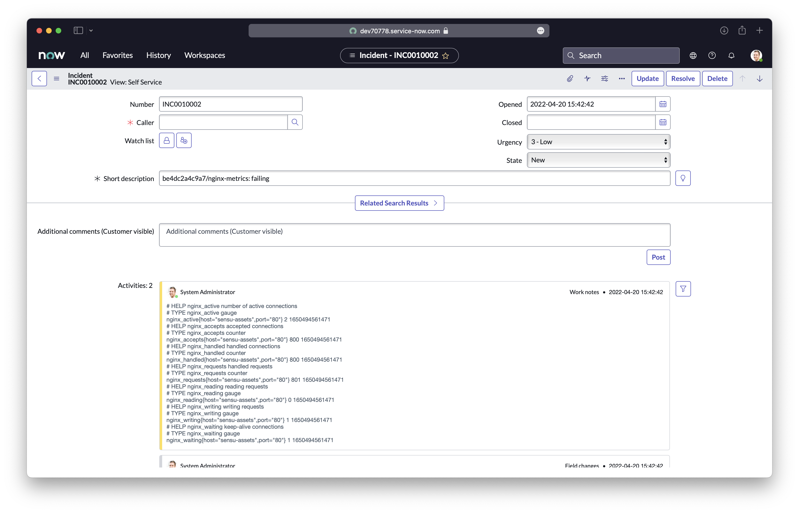

## Overview

<!-- Sensu Integration description; supports markdown -->

The ServiceNow Incident Management integration provides support for automatically creating, updating, and resolving ServiceNow Incidents from Sensu Events.

This integration supports custom ServiceNow Incident Management tables and custom Incident fields, with per-host and per-check configuration overrides.
See the Setup section below for more information.

<!-- Provide a high level overview of the integration contents (e.g. checks, filters, mutators, handlers, assets, etc) -->

This integration includes the following resources:

* `servicenow-incidents` [pipeline]
* `servicenow-incidents` [handler]
* `sensu/sensu-servicenow-handler:3.0.0` [asset]

## Dashboards

<!-- List of compatible dashboards w/ screenshots (supports png, jpeg, and gif images; relative paths only; e.g. `` )-->

This integration is compatible with ServiceNow Incident Management dashboards.



## Setup

<!-- Sensu Integration setup instructions, including Sensu agent configuration and external component configuration -->
<!-- EXAMPLE: what configuration (if any) is required in a third-party service to enable monitoring? -->

1. **Enable ServiceNow Incident management**

   Checks configured with the `servicenow-incidents` [pipeline] may be used to enable ServiceNow Incident Management.

   Example:

   ```yaml
   spec:
     pipelines:
       - api_version: core/v2
         type: Pipeline
         name: servicenow-incidents
   ```

1. **[OPTIONAL] Customize ServiceNow Incident Management configuration**

   Sensu Entity & Check annotations may be used to override the default ServiceNow Incident Management integration configuration.

   Examples:

   ```yaml
   annotations:
     servicenow/config/incident-table: "incident"
     servicenow/config/incident-work-notes: "{{ .Check.Annotations.servicenow_work_notes }}"
   ```

   For more information, please visit the [ServiceNow Handler "Annotations" reference documentation].

2. **[OPTIONAL] Customize ServiceNow Incident properties**

   This integration supports custom ServiceNow Incident Management tables with custom fields.
   To enable custom fields set the `--incident-properties` flag (e.g. `--incident-properties category,store_id`).
   _NOTE: The integration installation wizard will prompt you for a list of custom fields._

   Once enabled, custom properties can be set on a per-host basis _or_ a per-check basis by using `servicenow/table/incident/<fieldname>` annotations.

   Example (assuming `--incident-properties: category,store_id`):

   ```yaml
   annotations:
     servicenow/table/incident/category: "software"
     servicenow/table/incident/store_id: "1234"
   ```

[Sensu Entity]: https://docs.sensu.io/sensu-go/latest/observability-pipeline/observe-entities/entities/
[ServiceNow Handler "Annotations" reference documentation]: https://bonsai.sensu.io/assets/sensu/sensu-servicenow-handler#annotations

## Plugins

<!-- Links to any Sensu Integration dependencies (i.e. Sensu Plugins) -->

- [sensu/sensu-servicenow-handler][sensu-servicenow-handler-bonsai]

## Metrics & Events

<!-- List of all metrics or events collected by this integration. -->

This integration does not produce any [metrics].

## Alerts

<!-- List of all alerts generated by this integration. -->

<!-- This integration provides an alert & incident management processing pipeline for use with other monitoring integrations. By default this integration will process all events passing the [built-in `is_incident` filter][is_incident] (i.e. failing events and resolution events only). Event processing via this integration may be suppressed using [Sensu Silencing][silences] (see the [built-in `not_silenced` filter][not_silenced] for more details). -->

This integration does not produce any events that should be processed by an alert or incident management [pipeline].

## Reference Documentation

<!-- Please provide links to any relevant reference documentation to help users learn more and/or troubleshoot this integration; specifically including any third-party software documentation. -->

1. This integration uses [Handler Templating][handler-templating] for variable substitution.

<!-- Links -->
[check]: https://docs.sensu.io/sensu-go/latest/observability-pipeline/observe-schedule/checks/
[asset]: https://docs.sensu.io/sensu-go/latest/plugins/assets/
[subscription]: https://docs.sensu.io/sensu-go/latest/observability-pipeline/observe-schedule/subscriptions/
[subscriptions]: https://docs.sensu.io/sensu-go/latest/observability-pipeline/observe-schedule/subscriptions/
[agents]: https://docs.sensu.io/sensu-go/latest/observability-pipeline/observe-schedule/agent/
[annotation]: https://docs.sensu.io/sensu-go/latest/observability-pipeline/observe-schedule/agent/#general-configuration-flags
[plugins]: https://docs.sensu.io/sensu-go/latest/plugins/
[metrics]: https://docs.sensu.io/sensu-go/latest/observability-pipeline/observe-schedule/metrics/
[pipeline]: https://docs.sensu.io/sensu-go/latest/observability-pipeline/observe-process/pipelines/
[handler]: https://docs.sensu.io/sensu-go/latest/observability-pipeline/observe-process/handlers/
[filter]: https://docs.sensu.io/sensu-go/latest/observability-pipeline/observe-filter/filters/
[filters]: https://docs.sensu.io/sensu-go/latest/observability-pipeline/observe-filter/filters/
[secret]: https://docs.sensu.io/sensu-go/latest/operations/manage-secrets/secrets/
[secrets]: https://docs.sensu.io/sensu-go/latest/operations/manage-secrets/secrets/
[tokens]: https://docs.sensu.io/sensu-go/latest/observability-pipeline/observe-schedule/tokens/
[handler-templating]: https://docs.sensu.io/sensu-go/latest/observability-pipeline/observe-process/handler-templates/
[sensu-plus]: https://sensu.io/features/analytics
[{{dashboard-link}}]: #
[sensu-servicenow-handler-bonsai]: https://bonsai.sensu.io/assets/sensu/sensu-servicenow-handler
